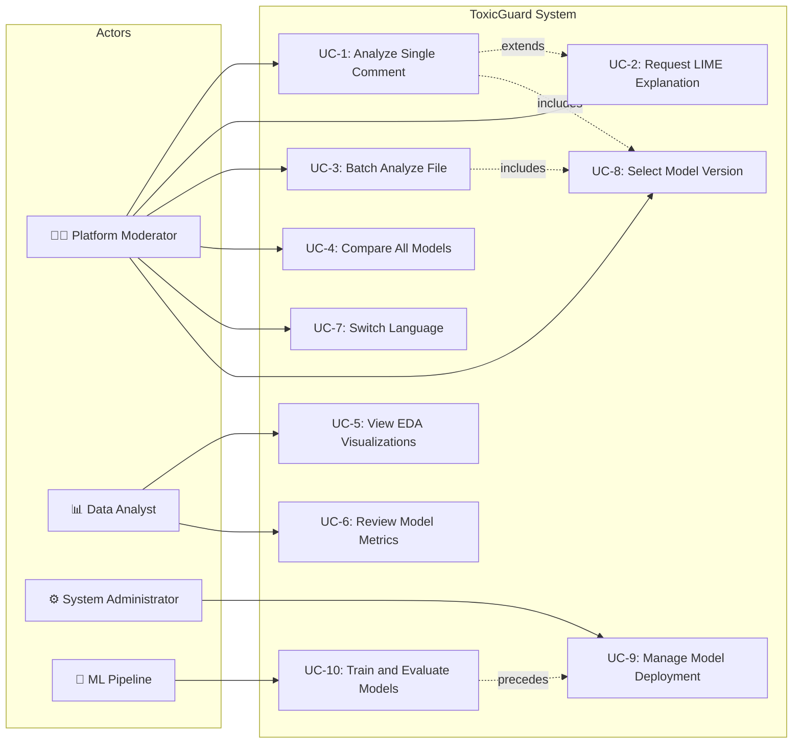
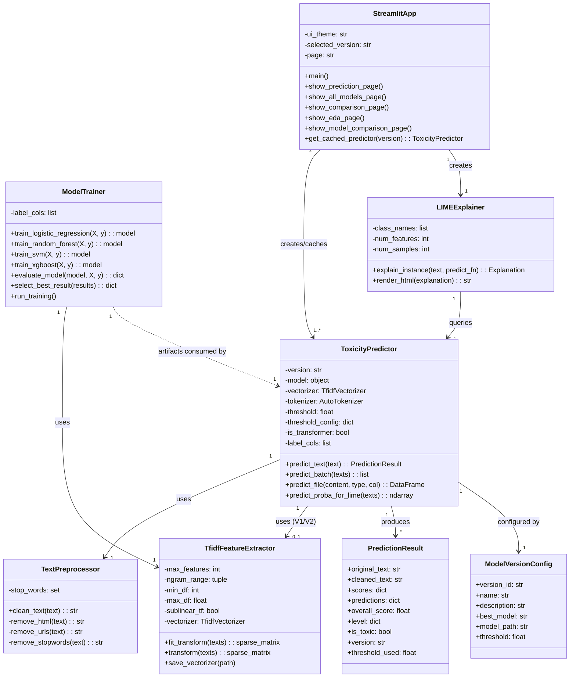

# 8. SYSTEM REQUIREMENTS ANALYSIS

## 8.a Use Case Model

### 8.a.1 System Overview

The ToxicGuard system is a web-based toxicity detection platform that serves three primary actor categories interacting with distinctly scoped functionality. The system exposes its capabilities through a Streamlit-based bilingual interface supporting real-time analysis, batch processing, explainable AI visualization, and multi-version model comparison. The use case model below captures the complete functional surface of the deployed system as implemented across four model versions (V1–V4).

### 8.a.2 Actor Identification

**Primary Actors:**

- **Platform Moderator (Moderatör):** The principal end-user of ToxicGuard. A content moderator working for an online platform who uses the system to analyze user-generated comments for toxicity. The moderator interacts with the single-comment analysis interface, reviews LIME explanations to verify prediction rationale, switches between model versions, and processes batch files of comments for bulk review. The moderator requires both Turkish and English interface support and expects transparent, auditable predictions.

- **Data Analyst (Veri Analisti):** A technical user responsible for evaluating model performance and understanding data characteristics. The data analyst accesses the EDA Visualization module to inspect dataset distributions, label correlations, and comment length statistics. They also use the Model Comparison page to review quantitative performance metrics (F1-Score, ROC-AUC, precision, recall) across all trained model versions and make informed recommendations about which model version to deploy.

**Secondary Actors:**

- **System Administrator (Sistem Yöneticisi):** Responsible for system deployment, model version management, and configuration. The administrator manages model files on the server, configures deployment parameters, and monitors system health. This actor interacts with the system at the infrastructure level rather than through the primary UI.

- **ML Pipeline (Otomatik Sistem):** An automated actor representing the offline training and evaluation pipeline. The ML Pipeline ingests raw data, executes preprocessing, trains models across multiple algorithm families, optimizes thresholds, and serializes trained artifacts for deployment. This actor operates independently of the real-time prediction interface.

### 8.a.3 Use Case Descriptions

**UC-1: Analyze Single Comment** — The moderator enters a single text comment into the analysis interface. The system preprocesses the text, applies the selected model version's classification pipeline, and returns per-label toxicity scores, binary predictions, an overall toxicity score, and a severity level badge (Safe/Warning/Toxic). The moderator can select any available model version (V1–V4) from the sidebar before analysis.

**UC-2: Request LIME Explanation** — After analyzing a comment, the moderator activates the "Neden Toksik?" (Why Toxic?) checkbox. The system generates a LIME-based local explanation by perturbing the input text, fitting a surrogate linear model, and rendering a color-coded HTML visualization showing which tokens contributed positively (toward toxicity) and negatively (toward safety) to the prediction. For Transformer models (V3/V4), the system uses reduced sample counts (30 vs. 100) to maintain acceptable response times.

**UC-3: Batch Analyze File** — The moderator uploads a `.txt` or `.csv` file containing multiple comments. The system processes each comment through the selected model version, generates a results table with per-comment toxicity scores and severity levels, and provides a downloadable CSV export of annotated results. For CSV files, the moderator selects the target text column before analysis.

**UC-4: Compare All Models** — The moderator enters a comment on the "Tüm Modeller" (All Models) page. The system sequentially loads all available model versions, runs inference on the same input, and displays side-by-side result cards showing each model's overall score, severity level, and per-label breakdown in a comparative table format.

**UC-5: View EDA Visualizations** — The data analyst accesses the EDA page to view pre-generated exploratory data analysis charts including label distribution bar charts, inter-label correlation heatmaps, comment length distributions, and word cloud visualizations for toxic vs. non-toxic content.

**UC-6: Review Model Performance Metrics** — The data analyst accesses the Model Comparison page to review training results including per-model F1 scores (micro/macro), ROC-AUC values, precision and recall metrics, and per-label performance breakdowns stored in `model_comparison.json`.

**UC-7: Switch Interface Language** — The moderator switches between Turkish and English interface modes. The V4 model additionally supports multilingual input analysis (English and Turkish comments analyzed by the same XLM-RoBERTa model).

**UC-8: Select Model Version** — The moderator selects a model version (V1–V4) from the sidebar dropdown. The system lazy-loads the selected model using cached resource management and displays version-specific metadata (model type, description, threshold configuration).

### 8.a.4 UML Use Case Diagram

### 8.a.5 Use Case Relationships

- **UC-1 «extends» UC-2:** LIME explanation is an optional extension triggered by the moderator after a standard analysis. It is not required for basic functionality.
- **UC-1 «includes» UC-8:** Every single-comment analysis requires a model version selection. The system defaults to V1 if no explicit selection is made.
- **UC-3 «includes» UC-8:** Batch analysis similarly requires version selection before processing.
- **UC-10 precedes UC-9:** Model training must complete before new model artifacts can be deployed by the administrator.

---

## 8.2 Object Model

### 8.2.1 System Architecture Overview

The ToxicGuard system follows a layered architecture comprising four primary subsystems: the **Presentation Layer** (Streamlit web application), the **Prediction Layer** (model inference and explanation engine), the **Data Processing Layer** (text preprocessing, feature extraction, and data management), and the **Model Training Layer** (offline training pipeline). The object model describes the principal classes, their attributes and operations, and the structural relationships that bind them into a cohesive system.

### 8.2.2 Core Class Descriptions

**ToxicityPredictor** — The central inference engine of the system. This class encapsulates all model loading, text preprocessing, and prediction logic. It supports four model versions through a unified interface: V1 and V2 use classical ML models (XGBoost, Linear SVM) loaded via joblib with TF-IDF vectorization, while V3 and V4 use Transformer models (DistilBERT, XLM-RoBERTa) loaded via Hugging Face's `AutoModelForSequenceClassification`. Key attributes include `version` (model version identifier), `model` (the loaded classifier), `vectorizer` (TF-IDF vectorizer for classical models), `tokenizer` (Transformer tokenizer for V3/V4), `threshold` (classification decision boundary), and `is_transformer` (boolean flag). Operations include `predict_text()` for single-comment inference, `predict_batch()` for multiple comments, `predict_file()` for file-based batch processing, and `predict_proba_for_lime()` which returns probability arrays in the format required by LIME's text explainer.

**StreamlitApp** — The presentation controller managing all UI pages, user interactions, and session state. It initializes the page configuration, manages theme switching (Dark/Light), and routes between five functional pages: Prediction, All Models, Version Comparison, EDA Visualization, and Model Comparison. It maintains cached model instances via `@st.cache_resource` to prevent redundant model loading across user interactions.

**TextPreprocessor** — Encapsulates the multi-stage text cleaning pipeline defined in `utils.py`. Operations include lowercase normalization, HTML tag removal, URL stripping, special character filtering, stopword removal using NLTK's English stopword list, and whitespace normalization. For Transformer models, this preprocessing is bypassed in favor of the model's native tokenizer.

**TfidfFeatureExtractor** — Manages TF-IDF vectorization using Scikit-learn's `TfidfVectorizer`. Configured with `max_features=50000`, `ngram_range=(1,2)`, `min_df=3`, `max_df=0.95`, and `sublinear_tf=True`. Provides `fit_transform()` for training and `transform()` for inference. The fitted vectorizer is serialized as `tfidf_vectorizer.pkl` for deployment.

**ModelTrainer** — Orchestrates the training pipeline across four classifier families: Logistic Regression (with `class_weight='balanced'`), Random Forest (`n_estimators=200`), Linear SVM (with `CalibratedClassifierCV` for probability support), and XGBoost (`scale_pos_weight=10`). All classifiers are wrapped in `OneVsRestClassifier` for multi-label support. The trainer evaluates each model using F1-Score, ROC-AUC, precision, and recall, selects the best performer by F1-macro, and serializes the winner as `best_model.pkl`.

**PredictionResult** — A data transfer object containing the complete output of a single prediction: `original_text`, `cleaned_text`, `scores` (per-label probability dictionary), `predictions` (per-label binary dictionary), `overall_score` (maximum label probability), `level` (severity classification with label, emoji, and color), `is_toxic` (boolean), `version`, and `threshold_used`.

**LIMEExplainer** — A wrapper around the `lime.lime_text.LimeTextExplainer` class. Configured with class names `['Zararsız', 'Toksik']`, it generates local explanations by perturbing input text, querying the predictor's probability function, and producing color-coded HTML visualizations. For Transformer models, `num_samples` is reduced from 100 to 30 for performance optimization.

**ModelVersionConfig** — A configuration object storing version-specific metadata: version identifier, display name, description, best model type, file paths, and threshold configuration. Defined in the `VERSION_INFO` dictionary within `predict.py`.

### 8.2.3 UML Class Diagram

### 8.2.4 Key Relationships

- **StreamlitApp → ToxicityPredictor (1..*):** The application creates and caches one predictor instance per model version using `@st.cache_resource`. Multiple versions can be loaded simultaneously when the "All Models" page is active.
- **ToxicityPredictor → TextPreprocessor (1..1):** Every predictor uses the shared text cleaning pipeline for classical models. Transformer models (V3/V4) bypass heavy preprocessing.
- **ToxicityPredictor → TfidfFeatureExtractor (0..1):** Only V1 and V2 predictors use TF-IDF vectorization. V3/V4 use Transformer tokenizers instead, making this an optional composition.
- **ToxicityPredictor → PredictionResult (1..*):** Each prediction call produces one result object per input text.
- **LIMEExplainer → ToxicityPredictor (1..1):** LIME queries the predictor's `predict_proba_for_lime()` method iteratively during perturbation-based explanation generation.
- **ModelTrainer ‥> ToxicityPredictor:** The trainer produces serialized model artifacts (`.pkl` and HuggingFace `save_pretrained` directories) that are consumed by the predictor at deployment time. This is a dependency relationship, not a runtime association.
